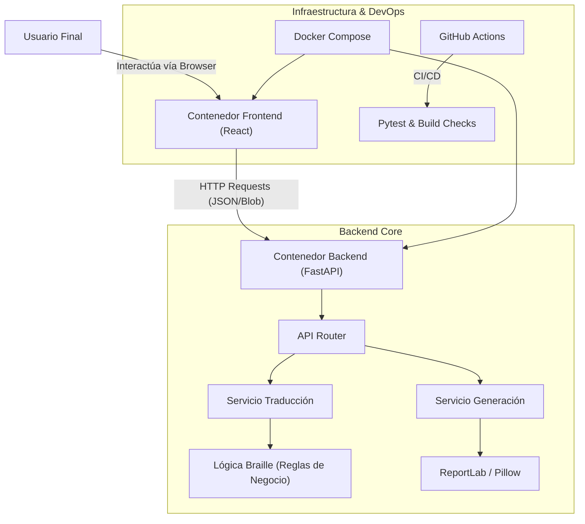

# Diseño de Arquitectura de Software - Proyecto Braille

## 1\. Visión General

El sistema es una aplicación web **Full Stack** diseñada para la transcripción bidireccional entre español y el sistema Braille, así como la generación de recursos accesibles (señalética en PDF e imágenes).

La arquitectura sigue el patrón de **Microservicios (simulado)** mediante contenedores Docker, desacoplando completamente el Frontend del Backend para permitir escalabilidad independiente y mantenimiento modular.

## 2\. Diagrama de Arquitectura (Alto Nivel)

## 3\. Componentes del Sistema

### 3.1. Frontend (Capa de Presentación)

Responsable de la interacción con el usuario y la visualización del sistema Braille.

  * **Tecnología:** React 18, Vite, TypeScript.
  * **Componentes Clave:**
      * `BrailleDisplay`: Orquestador de la visualización.
      * `BrailleCell`: Componente visual que renderiza el "Símbolo Generador" de 6 puntos usando CSS Grid.
      * `api.ts`: Capa de servicio para comunicación con el Backend.
  * **Comunicación:** Consume la REST API del backend para enviar texto y recibir matrices de puntos o archivos binarios (Blobs).

### 3.2. Backend (Capa de Lógica y Datos)

Expone la lógica de negocio a través de una API RESTful documentada automáticamente.

  * **Tecnología:** Python 3.10, FastAPI, Uvicorn.
  * **Módulos Principales:**
      * [cite\_start]**Core Logic (`braille_logic.py`):** Implementación pura de las reglas de traducción (Series 1, 2, 3, prefijos numéricos y mayúsculas) basada en el documento de requisitos [cite: 32-136].
      * **Translation Service:** Gestiona el estado y contexto (modo numérico) durante la traducción.
      * **Generation Service:** Utiliza `ReportLab` y `Pillow` para dibujar vectores y generar archivos descargables.

### 3.3. Infraestructura (DevOps)

El entorno está completamente "containerizado" para garantizar consistencia entre desarrollo y producción.

  * **Docker:** Contenedores aislados para Frontend (Node Alpine) y Backend (Python Slim).
  * **Docker Compose:** Orquestación de servicios, gestión de red interna (`braille_network`) y volúmenes para *Hot Reload* en desarrollo.
  * **CI/CD:** Pipeline de GitHub Actions que ejecuta pruebas unitarias (`pytest`) y verifica la compilación del frontend en cada *Push* o *Pull Request*.

## 4\. Flujo de Datos

1.  **Entrada:** El usuario ingresa texto en español en la interfaz web.
2.  **Procesamiento:**
      * El Frontend envía un `POST` con el texto.
      * El Backend recibe el JSON y lo valida con **Pydantic**.
      * El servicio de traducción descompone el texto, aplica las reglas de las Series Braille y genera una matriz de enteros (ej: `[[1,2], [1,5]]`).
3.  **Salida Visual:** El Frontend recibe la matriz y "pinta" los puntos correspondientes en la grilla CSS.
4.  **Generación de Archivos:**
      * Para PDFs/Imágenes, el Backend genera el archivo en memoria (`BytesIO`) y lo transmite como un `StreamingResponse`.
      * El Frontend recibe el flujo binario, crea un `Blob` y fuerza la descarga en el navegador.

## 5\. Decisiones Técnicas y Justificación

### 5.1. Lenguaje Backend: Python

Se eligió Python como lenguaje de programación para el backend debido a su facilidad excepcional en el manejo de strings y su amplio ecosistema de librerías robustas para generación de archivos. En particular, ReportLab proporciona capacidades avanzadas para crear documentos PDF de calidad profesional, mientras que la sintaxis clara de Python permite implementar la lógica compleja de traducción Braille de manera mantenible y legible. Esta selección garantiza que las transformaciones de caracteres españoles a representaciones Braille se realicen de forma eficiente y con mínimo overhead de codificación.

### 5.2. Framework API: FastAPI

FastAPI fue seleccionado como framework para construir la API REST del backend. Esta decisión se fundamenta en tres pilares principales: velocidad de ejecución superior a otros frameworks Python, soporte integrado para tipado estático que mejora la confiabilidad del código, y generación automática de documentación interactiva (Swagger/OpenAPI) que es un requerimiento explícito del proyecto. FastAPI permite que los desarrolladores definan esquemas de validación una sola vez usando Pydantic, reutilizando automáticamente esa información para documentación, validación y serialización de datos. Esta característica reduce significativamente el tiempo de desarrollo y minimiza errores de desincronización entre código y documentación.

### 5.3. Framework Frontend: React

React fue elegido como framework para la capa de presentación del sistema. La arquitectura basada en componentes de React es particularmente adecuada para este proyecto porque permite la creación de un componente reutilizable `BrailleCell` que representa visualmente cada celda del sistema Braille de 6 puntos. Esta reutilización de componentes reduce la duplicación de código, facilita el mantenimiento consistente de la interfaz visual, y proporciona una base sólida para futuras expansiones de funcionalidad. TypeScript proporciona tipado estático que detecta errores en tiempo de desarrollo, mejorando la calidad del código frontend.

### 5.4. Estrategia de Control de Versiones: GitFlow

Se implementó GitFlow como estrategia de ramificación en Git. Esta decisión responde a un requerimiento explícito del proyecto y proporciona una estructura clara para la organización del desarrollo con ramas principales (`main` para producción, `develop` para desarrollo), ramas de características (`feature/*` para nuevas funcionalidades), ramas de liberación (`release/*` para preparar versiones), y ramas de correcciones (`hotfix/*` para parches urgentes). Esta estructura facilita la colaboración entre desarrolladores, permite integración continua organizada, y proporciona trazabilidad clara de cambios y versiones del proyecto.

### 5.5. Estrategia de Despliegue: Docker

Docker fue seleccionado como tecnología de containerización para garantizar que el proyecto funcione de manera consistente en cualquier máquina sin necesidad de configurar entornos locales complejos. Los contenedores aíslan completamente las dependencias del backend (Python, librerías específicas) y del frontend (Node.js, paquetes npm), eliminando problemas de compatibilidad entre máquinas de desarrollo, servidores de prueba y producción. Docker Compose orquesta los múltiples contenedores (backend, frontend, red interna) con una sola configuración, simplificando enormemente el proceso de inicialización del entorno de desarrollo y asegurando que todos los desarrolladores trabajen en entornos idénticos.
